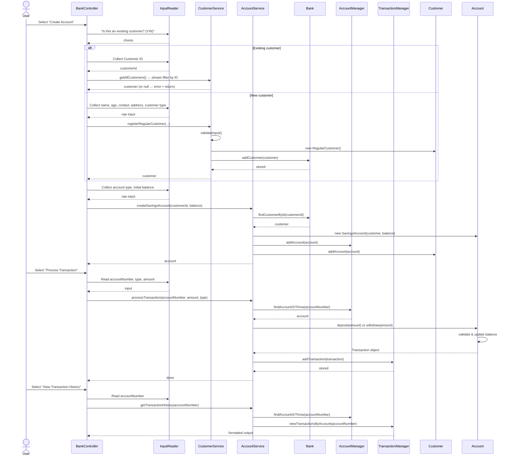

# Bank Management System — Architecture Documentation

---

## 1. Architecture Overview

The system follows a **layered Service Layer pattern** with a clear separation of concerns across four tiers:

```
┌─────────────────────────────────────┐
│          Presentation Layer         │  BankController, InputReader
├─────────────────────────────────────┤
│           Service Layer             │  AccountService, CustomerService
├─────────────────────────────────────┤
│           Manager Layer             │  AccountManager, TransactionManager, Bank
├─────────────────────────────────────┤
│            Domain Layer             │  Account, Customer, Transaction (+ subclasses)
└─────────────────────────────────────┘
```

**Key principles applied:**

- **Single Responsibility:** Each class owns exactly one concern (e.g. `TransactionManager` only stores and queries transactions; it never touches account balances).
- **Abstract Base Classes:** `Account` and `Customer` are abstract — concrete behaviour lives in `SavingsAccount`/`CheckingAccount` and `RegularCustomer`/`PremiumCustomer`.
- **Dependency Injection:** `AccountService` receives `Bank`, `AccountManager`, and `TransactionManager` through its constructor, keeping it testable and loosely coupled.
- **Single Source of Truth (SSOT):** `TransactionManager` is the authoritative ledger; every state-changing financial operation is recorded there.

---

## 2. Class Responsibilities

### Domain Layer

| Class | Type | Responsibility |
|---|---|---|
| `Account` | Abstract class | Holds balance, owns the math for `deposit()` / `withdraw()`, enforces closed-account rules, creates `Transaction` objects after each operation. Implements `Transactable`. |
| `SavingsAccount` | Concrete (`extends Account`) | Adds a 3.5 % interest rate and a $500 minimum-balance constraint enforced in `validateWithdrawal()`. `calculateInterest()` returns `balance * interestRate` (the interest amount earned). |
| `CheckingAccount` | Concrete (`extends Account`) | Adds a $1,000 overdraft limit and a $10 monthly fee that is automatically waived for Premium customers. `applyMonthlyFee()` returns a `Transaction` (or `null` if waived) so `AccountService` can log it. |
| `Customer` | Abstract class | Stores identity fields (name, age, contact, address), owns a `List<Account>`, and exposes `addAccount()` / `getAccounts()`. |
| `RegularCustomer` | Concrete (`extends Customer`) | No fee waiver; `isEligibleForFeeWaiver()` returns `false`. |
| `PremiumCustomer` | Concrete (`extends Customer`) | `isEligibleForFeeWaiver()` returns `true`, triggering fee-free `CheckingAccount` creation. |
| `Transaction` | Data/record class | Immutable snapshot of one financial event: account number, type (`DEPOSIT`/`WITHDRAWAL`), amount, post-transaction balance, and an auto-generated timestamp. |

### Manager Layer

| Class | Type | Responsibility |
|---|---|---|
| `Bank` | Repository | `HashMap<String, Customer>` — the master customer registry; provides O(1) lookup by customer ID. |
| `AccountManager` | Repository | Fixed array of up to 50 `Account` objects; provides `findAccountOrThrow()` (throws `AccountNotFoundException` if not found) and `getAccounts()` (returns a copy of the used slice for iteration). |
| `TransactionManager` | Ledger / SSOT | Fixed array of up to 200 `Transaction` records; appends every financial event and exposes per-account history, deposit totals, and withdrawal totals. |

### Service Layer

| Class | Type | Responsibility |
|---|---|---|
| `AccountService` | Orchestrator | The single entry point for all account and financial operations. Coordinates `Bank`, `AccountManager`, and `TransactionManager`. Exposes: account creation, `processTransaction()` (unified deposit/withdrawal entry point), close account (soft delete), `applyMonthlyFees()` (batch fee deduction for all non-waived checking accounts), and `applyInterest()` (batch interest credit for all active savings accounts). |
| `CustomerService` | Orchestrator | Validates and creates `RegularCustomer` / `PremiumCustomer` objects, then registers them in `Bank`. |

### Presentation / I/O Layer

| Class | Type | Responsibility |
|---|---|---|
| `BankController` | Controller | Main menu loop (8 options); translates raw user choices into service calls; catches and displays domain exceptions. Handles: create, view, transact, history, close account, apply fees/interest, view customer accounts, exit. |
| `InputReader` | I/O helper | Wraps `Scanner`; provides validated reads for strings, menu choices, amounts, and positive integers with automatic re-prompt on invalid input. |
| `DataInitializer` | Bootstrap utility | Populates the system with 5 sample customers and 6 sample accounts on startup (Michael Chen holds two accounts to demonstrate multi-account customers). |
| `Main` | Entry point | Wires all dependencies together (manual DI) and launches `BankController.start()`. |

### Shared Utilities

| Class / Interface | Responsibility |
|---|---|
| `Transactable` (interface) | Contract (`processTransaction(double, String)`) that `Account` fulfils. |
| `InputValidator` | Static validation helpers (name, amount, menu choice, ID). |
| `InvalidAmountException` | Thrown for negative or zero monetary values. |
| `InsufficientFundsException` | Thrown when a withdrawal would breach the minimum balance or overdraft limit. |
| `AccountNotFoundException` | Thrown when a lookup by account / customer ID fails. |
| `IllegalStateException` | Thrown when an operation is attempted on a closed account. |

---

## 3. Dependency Graph

```
Main
 ├─ Bank
 ├─ AccountManager
 ├─ TransactionManager
 ├─ AccountService ──────── Bank, AccountManager, TransactionManager
 ├─ CustomerService ──────── Bank
 ├─ InputReader
 └─ BankController ───────── AccountService, CustomerService, InputReader

Account (abstract) ──── implements Transactable
 ├─ references Customer
 ├─ creates Transaction
 ├─ SavingsAccount
 └─ CheckingAccount

Customer (abstract)
 ├─ owns List<Account>
 ├─ RegularCustomer
 └─ PremiumCustomer
```

---

## 4. Sequence Flows

### 4.1 Application Startup

```
Main.main()
  │
  ├─ new Bank()
  ├─ new AccountManager()          ← capacity: 50 accounts
  ├─ new TransactionManager()      ← capacity: 200 transactions
  ├─ new AccountService(bank, accountManager, transactionManager)
  ├─ new CustomerService(bank)
  ├─ new InputReader()
  ├─ DataInitializer.initializeSampleData(accountService, customerService)
  │     └─ creates 5 customers + 6 accounts via the service layer
  └─ new BankController(...).start()   ← enters the menu loop
```

---

### 4.2 Account Creation Flow

**User selects menu option 1 — Create Account.**

```
BankController.handleCreateAccount()
  │
  ├─[1] "Is this an existing customer? (Y/N)"
  │
  ├─[PATH A — existing customer]
  │     ├─ InputReader reads: Customer ID
  │     ├─ customerService.getAllCustomers().stream().filter(id match).findFirst()
  │     │     └─ not found → printError(), return early
  │     └─ customer resolved ─────────────────────────────────────────┐
  │                                                                    │
  ├─[PATH B — new customer]                                           │
  │     ├─ InputReader collects: name, age, contact, address, type    │
  │     ├─ CustomerService.registerRegularCustomer()                  │
  │     │     ├─ validateInput()       ← checks no empty strings      │
  │     │     ├─ new RegularCustomer() ← auto-assigns CUST00N id      │
  │     │     └─ Bank.addCustomer()    ← stored in HashMap            │
  │     └─ customer resolved ─────────────────────────────────────────┤
  │                                                                    │
  └─[3] AccountService.createSavingsAccount()  (or createCheckingAccount())
          ├─ Bank.findCustomerById()            ← retrieve Customer object
          ├─ Validate minimum deposit           ← $500 Savings / $0 Checking
          ├─ new SavingsAccount(customer, balance)
          │     └─ Account constructor auto-assigns ACC00N id
          ├─ AccountManager.addAccount()        ← stored in Account[]
          └─ Customer.addAccount()              ← account linked to its owner
```

**Key design points:**
- Both paths converge at the same `AccountService` call — no duplication of account creation logic.
- An existing customer can now accumulate multiple accounts over time, matching the reality that `Customer.accounts` is an `ArrayList` (not a fixed single slot).
- `AccountService` remains the only class that writes to both `AccountManager` and `Customer.addAccount()`, keeping the two registries in sync.

---

### 4.3 Financial Transaction Flow (Deposit or Withdrawal)

**User selects menu option 3 — Process Transaction.**

```
BankController.handleProcessTransaction()
  │
  ├─[1] InputReader reads: account number, transaction type (1=Deposit/2=Withdrawal), amount
  │
  ├─[2] AccountService.getAccountDetails(accountNumber)
  │       └─ AccountManager.findAccountOrThrow()   ← throws AccountNotFoundException if missing
  │             (used to display a confirmation summary to the user)
  │
  ├─[3] User confirms the transaction
  │
  └─[4] AccountService.processTransaction(accountNumber, amount, txnType)
                │
                ├─ Guard: type must be "DEPOSIT" or "WITHDRAWAL"  (IllegalArgumentException)
                │
                ├─ AccountManager.findAccountOrThrow()       ← retrieve live Account object
                │
                ├─ Account.deposit(amount)                   ← or Account.withdraw(amount)
                │     ├─ Guard: account must be Active       (IllegalStateException)
                │     ├─ Guard: amount must be > 0           (InvalidAmountException)
                │     ├─ [withdraw only] validateWithdrawal()
                │     │     ├─ SavingsAccount: balance − amount ≥ $500   (InsufficientFundsException)
                │     │     └─ CheckingAccount: balance − amount ≥ −$1000 (InsufficientFundsException)
                │     ├─ balance updated in place on the Account object
                │     └─ returns new Transaction(accountNumber, type, amount, newBalance)
                │
                └─ TransactionManager.addTransaction(transaction)   ← appended to Transaction[]
```

**Key design point:** `BankController` makes a single call to `AccountService.processTransaction()` for all financial operations — it never calls `deposit()` or `withdraw()` directly. `AccountService.processTransaction()` owns the routing (DEPOSIT vs WITHDRAWAL), finding the account, executing the operation, and logging the result. The `Account` object is still the only place where balance arithmetic happens; `AccountService` coordinates without doing the math itself.

---

### 4.4 View Transaction History Flow

**User selects menu option 4 — View Transaction History.**

```
BankController.handleViewTransactionHistory()
  │
  ├─[1] InputReader reads: account number
  │
  └─[2] AccountService.getTransactionHistory(accountNumber)
          ├─ AccountManager.findAccountOrThrow()       ← verify account exists
          └─ TransactionManager.viewTransactionsByAccount(accountNumber)
                ├─ Iterates Transaction[] in reverse (newest first)
                ├─ Filters by accountNumber
                ├─ Calls Transaction.displayTransactionDetails() for each match
                └─ Prints summary: total deposits, total withdrawals, net change
```

---

### 4.5 Close Account Flow (Soft Delete)

**User selects menu option 5 — Close Account.**

```
BankController.handleCloseAccount()
  │
  ├─[1] InputReader reads: account number
  │
  ├─[2] AccountService.getAccountDetails(accountNumber)
  │       └─ AccountManager.findAccountOrThrow()   ← throws AccountNotFoundException if missing
  │
  ├─[3] BankController checks account.getBalance() != 0
  │       └─ if balance is not zero → prints error, returns early (no service call made)
  │
  ├─[4] User confirms closure
  │
  └─[5] AccountService.closeAccount(accountNumber)
          ├─ AccountManager.findAccountOrThrow()
          ├─ Guard: balance must be exactly 0        (IllegalStateException if not)
          └─ Account.closeAccount()                  ← sets status field to "Closed"
                (account remains in AccountManager array — soft delete, not physical removal)
```

**Key design point:** Closure is a soft delete — the `Account` object stays in the `AccountManager` array permanently with `status = "Closed"`. This preserves the full transaction history in `TransactionManager` and the account reference in the customer's account list. No data is lost. Deposits and withdrawals on a closed account throw `IllegalStateException` at the guard-clause level in `Account.deposit()` / `Account.withdraw()`.

---

### 4.6 Apply Monthly Fees & Interest Flow

**User selects menu option 6 — Apply Monthly Fees & Interest.**

```
BankController.handleApplyFeesAndInterest()
  │
  ├─[1] Shows preview: "$10 fee for non-waived Checking / 3.5% interest for active Savings"
  ├─[2] User confirms
  │
  ├─[3] AccountService.applyMonthlyFees()
  │       ├─ AccountManager.getAccounts()            ← returns Account[] slice (only used slots)
  │       └─ for each account in slice:
  │             if instanceof CheckingAccount:
  │               Transaction t = ca.applyMonthlyFee()
  │                 ├─ if feesWaived → returns null  (skipped)
  │                 └─ if not waived → Account.withdraw(10.00) → returns Transaction
  │               if t != null → TransactionManager.addTransaction(t)
  │       returns count of accounts charged
  │
  └─[4] AccountService.applyInterest()
          ├─ AccountManager.getAccounts()            ← returns Account[] slice
          └─ for each account in slice:
                if instanceof SavingsAccount AND status == "Active":
                  interest = sa.calculateInterest()  ← balance * 0.035
                  Transaction t = account.deposit(interest)
                  TransactionManager.addTransaction(t)
          returns count of accounts credited
```

**Key design point:** Both batch operations go through `AccountManager.getAccounts()` (which returns `Arrays.copyOf(accounts, accountCount)` — only the live portion of the array) and funnel every resulting `Transaction` through `TransactionManager`, keeping the ledger as SSOT. Fee deductions and interest credits are indistinguishable from regular withdrawals/deposits in the ledger — they appear as `WITHDRAWAL` and `DEPOSIT` entries with the same timestamp format.

---

### 4.7 Full System Interaction Map (Mermaid)



---

## 5. Data Ownership & Why TransactionManager is the SSOT

### The Problem
A bank system has two representations of financial state:
1. The **live balance** on an `Account` object (used for calculations and rule enforcement).
2. The **historical record** of every event that produced that balance.

Without discipline, these can drift apart — a bug might update the balance without logging the transaction, or vice versa.

### The Solution: TransactionManager as SSOT

Every path through which money moves in this system ends with a call to `TransactionManager.addTransaction()`. This is enforced structurally — `Account.deposit()` and `Account.withdraw()` both *return* a `Transaction` object, and `AccountService` is required to pass that object to `TransactionManager`. There is no way to change a balance through the service layer without also creating a ledger entry.

```
Account.deposit()  ─► returns Transaction  ─► AccountService ─► TransactionManager.addTransaction()
Account.withdraw() ─► returns Transaction  ─► AccountService ─► TransactionManager.addTransaction()
```

As a result:

- `TransactionManager.calculateTotalDeposits(accountNumber)` minus `calculateTotalWithdrawals(accountNumber)` will always equal the current `Account.getBalance()` (assuming the same initial deposit).
- Any discrepancy would point to a bug in the service layer — a very small surface area to audit.
- The ledger is write-once (array append only); no transaction is ever modified or deleted.

### How AccountService Keeps the System Synchronized

`AccountService` is the only class allowed to write to both `AccountManager` and `Customer.addAccount()` simultaneously during account creation. It is also the only class that calls both `Account.deposit()`/`Account.withdraw()` (mutating live state) and `TransactionManager.addTransaction()` (recording history). This central role means:

- **No orphaned accounts:** A new account is always registered in both the manager's lookup array and the owning customer's personal account list in the same method call.
- **No unlogged transactions:** Every balance change produces a `Transaction` that is immediately handed to `TransactionManager`.
- **No partial updates:** If account creation or a transaction fails mid-way (e.g. `AccountNotFoundException`, `InsufficientFundsException`), an exception propagates before any state is written, leaving the system unchanged.

---

## 6. Package Structure

```
com.bank_management_system
 ├── Main.java                    Entry point & dependency wiring
 ├── BankController.java          Menu loop & user interaction
 ├── InputReader.java             Validated console input
 ├── DataInitializer.java         Sample data bootstrap
 │
 ├── bank/
 │    └── Bank.java               Customer registry (HashMap)
 │
 ├── accounts/
 │    ├── Account.java            Abstract domain object
 │    ├── SavingsAccount.java     Savings-specific rules
 │    ├── CheckingAccount.java    Checking-specific rules
 │    ├── AccountManager.java     Account repository (array)
 │    └── AccountService.java     Account & transaction orchestrator
 │
 ├── customers/
 │    ├── Customer.java           Abstract domain object
 │    ├── RegularCustomer.java    Standard customer
 │    ├── PremiumCustomer.java    Fee-exempt customer
 │    └── CustomerService.java    Customer registration orchestrator
 │
 ├── transactions/
 │    ├── Transaction.java        Immutable event record
 │    └── TransactionManager.java Transaction ledger (SSOT)
 │
 └── shared/
      ├── Transactable.java            Interface for Account
      ├── InputValidator.java          Static validation helpers
      ├── InvalidAmountException.java
      ├── InsufficientFundsException.java
      ├── AccountNotFoundException.java
      ├── IllegalStateException.java
      └── IllegalArgumentException.java
```

---

## 7. Data Structures & Algorithms (DSA)

The system does not use a dedicated DSA library, but it applies several classic data structure and algorithm concepts — some explicit in the code, others embedded in the design patterns. This section maps each concept to the exact class and method that implements it.

---

### 7.1 Data Structures

#### Fixed-Size Array (Bounded Buffer)

**Where:** `AccountManager.accounts` (capacity 50), `TransactionManager.transactions` (capacity 200).

```
Account[]     accounts     = new Account[50];      // AccountManager
Transaction[] transactions = new Transaction[200]; // TransactionManager
```

**DSA concept:** A **static/bounded array** paired with a manual integer index (`accountCount`, `transactionCount`) that tracks the next free slot. This is the same technique used to implement a **bounded buffer** or a **circular buffer** (without the wrap-around here). The index is incremented on every `addAccount()` / `addTransaction()` call; a capacity check before insertion prevents array overflow.

**Trade-off vs ArrayList:** O(1) indexed access and zero resizing overhead, but the capacity is fixed at compile time. If more than 50 accounts are needed, the constant must be changed and recompiled.

---

#### Dynamic Array (ArrayList)

**Where:** `Customer.accounts` — `List<Account> accounts = new ArrayList<>()`.

**DSA concept:** A **dynamic array** that grows automatically as accounts are added to a customer. The JVM doubles the backing array when capacity is exceeded (amortised O(1) append). Used here because the number of accounts per customer is unknown at construction time.

**Trade-off vs fixed array:** Flexible size but has occasional O(n) resizing cost and slightly higher memory overhead.

---

#### Hash Map (Hash Table)

**Where:** `Bank.customers` — `Map<String, Customer> customers = new HashMap<>()`.

```
customers.put(customer.getCustomerId(), customer);   // insert
customers.get(customerId);                           // O(1) lookup
```

**DSA concept:** A **hash table** using customer IDs (strings like `"CUST001"`) as keys. The JVM computes `String.hashCode()`, maps it to a bucket, and stores the entry there. Average-case lookup, insert, and delete are all **O(1)**. Contrast this with `AccountManager`, which stores accounts in a plain array and must do a **linear scan** to find one — O(n). The `Bank` chose a HashMap because customers are looked up by ID from many places; `AccountManager` chose an array because 50 accounts is small enough that O(n) is acceptable.

---

#### Unmodifiable / Defensive-Copy View

**Where:** `Customer.getAccounts()` — returns `Collections.unmodifiableList(accounts)`.

**DSA concept:** A **read-only wrapper** around the internal list. It is not a separate data structure — it is the same backing `ArrayList` exposed through an interface that throws `UnsupportedOperationException` on any mutating call. This is the **Defensive Copy** pattern: callers can iterate and read, but they cannot add or remove accounts without going through `Customer.addAccount()`. Preserves invariants without copying data.

---

#### Append-Only Log (Write-Once Array)

**Where:** `TransactionManager.transactions[]`.

**DSA concept:** An **append-only log** — records are only ever added, never modified or deleted. This mirrors the concept behind **WAL (Write-Ahead Logging)** in databases and **event sourcing** in distributed systems. The current balance of any account is the sum of all its log entries; the array is the authoritative record from which any derived state can be recomputed.

---

#### Auto-Increment ID Counter (Sequence Generator)

**Where:** `Account.accountCounter` (static), `Customer.customerCounter` (static), `Transaction.transactionCounter` (static).

```java
// Example from Account:
private static int accountCounter = 0;
// In constructor:
this.accountNumber = String.format("ACC%03d", ++accountCounter);
```

**DSA concept:** A **monotonically increasing sequence generator** — the same concept as `AUTO_INCREMENT` in SQL or `SEQUENCE` objects in PostgreSQL. The static field is shared across all instances of the class, so every new object gets a globally unique, ordered ID. The format (`%03d`) zero-pads the number to three digits, making IDs lexicographically sortable as well as numerically sortable.

---

### 7.2 Algorithms

#### Linear Search

**Where:** `AccountManager.findAccountOrThrow(String accountNumber)`.

```
for (int i = 0; i < accountCount; i++) {
    if (accounts[i].getAccountNumber().equals(accountNumber)) {
        return accounts[i];   // early exit on match
    }
}
throw new AccountNotFoundException("Account not found: " + accountNumber);
```

**DSA concept:** A **sequential / linear search** — O(n) time, O(1) space. The algorithm scans from index 0 until a match is found or the used portion of the array is exhausted. With a maximum of 50 accounts this is perfectly efficient; a binary search or hash map would add complexity with no meaningful gain at this scale.

**Early-exit / fail-fast:** The `return` inside the loop is a hard exit — the moment a match is found, the method is done. If the loop completes without returning, the `throw` fires. There is no `else` branch needed; `return` and `throw` are both terminators, so code after them in the same path can never run. This is a **guard clause** pattern: establish success early, throw at the bottom as the failure sentinel.

---

#### Reverse Traversal (Newest-First Display)

**Where:** `TransactionManager.viewTransactionsByAccount()`.

```
for (int i = transactionCount - 1; i >= 0; i--) {
    if (transactions[i].getAccountNumber().equals(accountNumber)) {
        transactions[i].displayTransactionDetails();
    }
}
```

**DSA concept:** **Reverse iteration** over an array — traverses from the last used index down to 0. Because transactions are appended in chronological order, iterating in reverse yields the most recent record first. This gives the user a **newest-first / LIFO** view without any sorting or auxiliary data structure. Time complexity remains O(n); no extra memory is used.

**Conceptual link:** This is equivalent to reading a **stack** from top to bottom — even though a stack is not used, the reverse iteration replicates its pop-order traversal.

---

#### Filter + Accumulate (Map-Reduce style)

**Where:** `TransactionManager.calculateTotalDeposits()` and `calculateTotalWithdrawals()`.

```
// Pseudocode of what both methods do:
total = 0
for each transaction in transactions[0..transactionCount]:
    if transaction.accountNumber == target AND transaction.type == "DEPOSIT":
        total += transaction.amount
return total
```

**DSA concept:** A **filter-then-accumulate** pass — a specific form of the general **reduce / fold** operation. The filter predicate is `accountNumber matches AND type matches`; the accumulator is a running sum. In functional programming this is `stream.filter(...).mapToDouble(...).sum()`. The explicit loop here does the same thing imperatively. Time complexity is O(n) per call; the two calls (deposits + withdrawals) make two full passes.

**Optimisation note:** Both totals could be computed in a single pass with two accumulators. The current two-pass approach is clearer to read and adequate given the 200-transaction ceiling.

---

#### Guard Clause / Early-Exit Validation Chain

**Where:** `Account.deposit()`, `Account.withdraw()`, and all `validateWithdrawal()` implementations.

```
if (status.equals("Closed"))  throw IllegalStateException
if (amount <= 0)              throw InvalidAmountException
validateWithdrawal(amount)    // subclass-specific check
// Only here does balance change
balance += amount;
```

**DSA concept:** **Guard clauses** — a sequence of pre-condition checks that each exit the method immediately on failure. This is an application of **fail-fast** design: the method does the cheapest checks first (status, amount sign) before the domain-specific check (`validateWithdrawal`). Only after all guards pass does the mutation occur. This eliminates deeply nested `if-else` trees and ensures the object is never left in a partially-modified state.

---

#### Polymorphic Dispatch (Runtime Algorithm Selection)

**Where:** `Account.validateWithdrawal()` — abstract in `Account`, implemented differently in `SavingsAccount` and `CheckingAccount`.

| Call site | Runtime type | Algorithm selected |
|---|---|---|
| `account.validateWithdrawal(amount)` | `SavingsAccount` | Enforce `balance - amount >= 500` |
| `account.validateWithdrawal(amount)` | `CheckingAccount` | Enforce `balance - amount >= -1000` |

**DSA concept:** **Dynamic dispatch** — the JVM resolves the method at runtime based on the actual object type, not the declared reference type. This is the object-oriented embodiment of the **Strategy pattern**: the withdrawal-validation algorithm is swapped in transparently depending on account type. `AccountService` calls `account.withdraw()` without knowing or caring which subclass it holds; the correct rule is applied automatically.

---

#### Hash-Based vs Array-Based Lookup: A Direct Comparison

The system contains two registries that serve similar purposes but use different underlying structures. This is a good illustration of choosing the right data structure for the access pattern:

| | `Bank` (customers) | `AccountManager` (accounts) |
|---|---|---|
| **Structure** | `HashMap<String, Customer>` | `Account[]` fixed array |
| **Lookup** | O(1) average by key | O(n) linear scan by account number |
| **Insert** | O(1) average | O(1) append (index known) |
| **Why this choice** | Customers are looked up by ID from multiple service methods; O(1) is worth the hash overhead | Max 50 accounts; O(n) over 50 elements is ~50 comparisons — negligible; simpler to reason about |
| **Capacity** | Unbounded (grows with load factor) | Fixed at 50 |

---

### 7.3 Implicit Algorithmic Concepts Summary

| Concept | Classic DSA Term | Where in the codebase |
|---|---|---|
| Fixed array + manual index | Bounded buffer | `AccountManager`, `TransactionManager` |
| Dynamic array | ArrayList / amortised array | `Customer.accounts` |
| Key-value lookup | Hash table / dictionary | `Bank.customers` (HashMap) |
| Read-only list wrapper | Defensive copy / immutable view | `Customer.getAccounts()` |
| Append-only records | Write-ahead log / event log | `TransactionManager.transactions` |
| Static auto-increment | Sequence generator | `Account`, `Customer`, `Transaction` constructors |
| Sequential scan | Linear search O(n) | `AccountManager.findAccountOrThrow()` |
| Bottom-up iteration | Reverse traversal / stack-order | `TransactionManager.viewTransactionsByAccount()` |
| Filter + sum | Reduce / fold | `TransactionManager.calculateTotalDeposits/Withdrawals()` |
| Pre-condition chain | Guard clauses / fail-fast | `Account.deposit()`, `Account.withdraw()` |
| Abstract method override | Dynamic dispatch / Strategy | `validateWithdrawal()`, `getAccountType()` |
